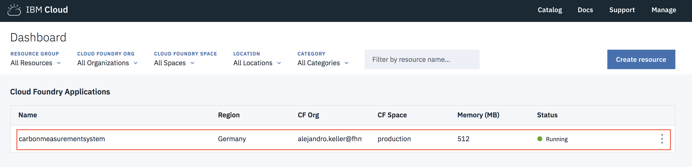
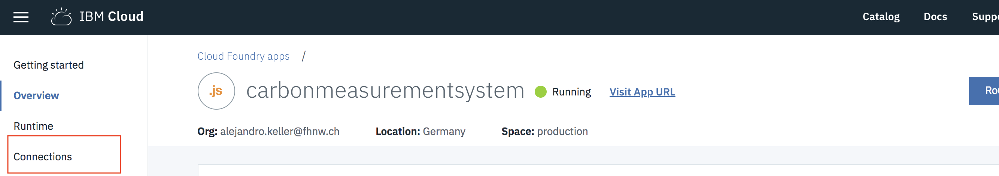
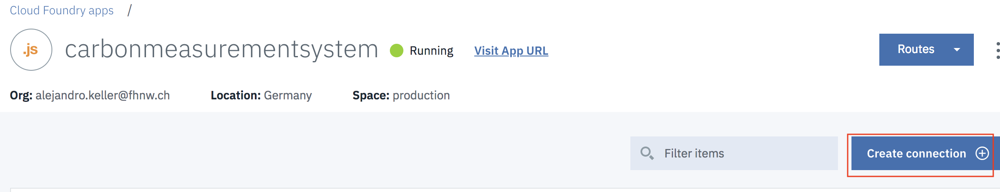
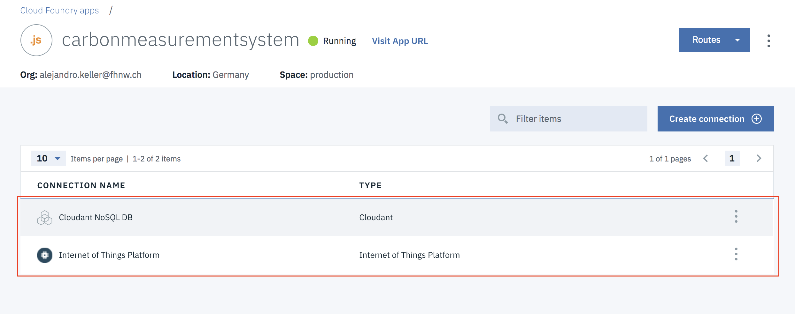
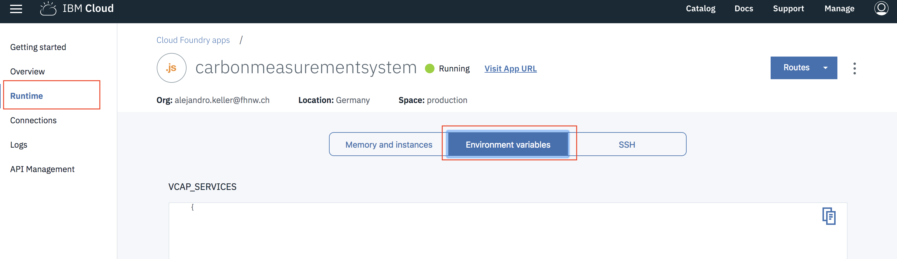
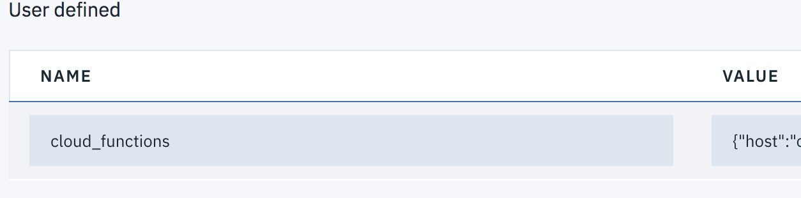

# FATCAT Control & Visualization System
## Node.js Application

### **Installation or App Update (Production)**
*Instructions taken from https://console.bluemix.net/docs/starters/upload_app.html*

1. Clone repository:
```bash
$ git clone https://github.com/javicuriel/FATCAT-Server
```
2. Travel to cloned folder:
```bash
$ cd FATCAT-Server
```

3. Install the [IBM® Cloud command line interface.](http://clis.ng.bluemix.net/ui/home.html)

4. Connect to IBM cloud `location ej. eu-de`
```bash
$ bluemix api https://api.{location}.bluemix.net
```
5. Log in to IBM Cloud.
```
$ bluemix login -u bluemix login -u username -o  -o org_name -s  -s space_namespace_name
```
6. From your application directory, enter the bluemix app push command with the application name. The app name must be unique in the IBM Cloud environment.
```bash
$ bluemix app push app_name -m 512m
```

*If it is the first time the application is pushed to the cloud, the connections must be established in order for the application to connect with MQTT server, Cloudant noSQL Database and IBM Cloud Functions.*
#### **Create connections(Production)**
1. Go the cloud console and choose the Cloud Foundry Application.



2. Select connections


3. Select create connections


4. Results:


5. Go to runtime and environment variables and on the bottom of the page click add user defined variable.


6. Add the following variable for cloud functions connection.
```javascript
cloud_functions = {
  "host": {host},
  "key": {key}
}
```



### **Installation (localhost)**
1. Clone repository:
```bash
$ git clone https://github.com/javicuriel/FATCAT-Server
```
2. Travel to cloned folder:
```bash
$ cd FATCAT-Server
```
3. Edit in line 7 of `config/cloud.js` the MQTT server configuration
```javascript
var config = {
    "org" : "kbld7d",
    "domain": "internetofthings.ibmcloud.com",
    "http_host": "kbld7d.internetofthings.ibmcloud.com",
    "apiKey" : {yourKey},
    "apiToken" : {yourToken}
};
```
4. Create `dbcredentials.js` in the main directory with cloudant database credentials
*ej.*
```javascript
module.exports = {
  "username": {dbusername},
  "password": {dbpassword},
  "host": {host},
  "port": {port},
  "url": {url}
}
```
5. Run the following commands to install dependencies:
```bash
$ npm install
```
```bash
$ bower install
```
6. Start app
```bash
$ npm start
```
7. Open the browser and go to `http://localhost:3000/`
